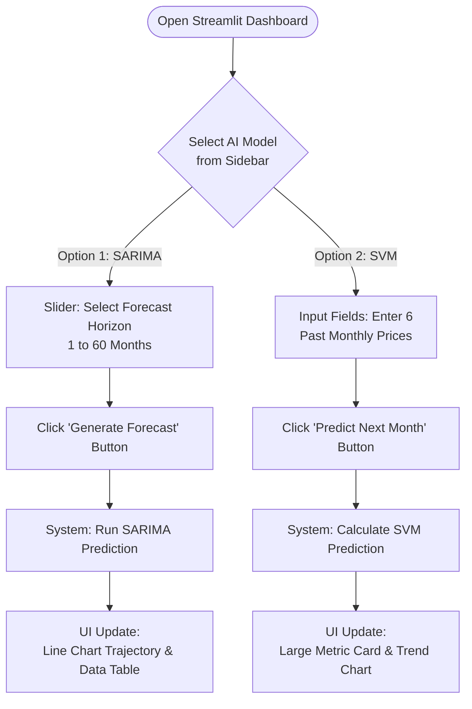
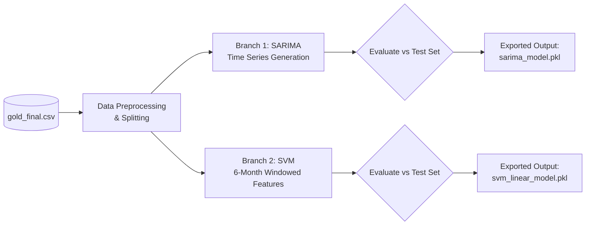

# SACAIM25 Project Flowcharts & Design Document

## 1. Understanding Summary
*   **What is being built:** A set of three flowchart diagrams (System Architecture, End-User Flow, and Data & Training Pipeline) written in Mermaid.js markdown syntax.
*   **Why it exists:** To visually explain the project’s structure, how data is processed to train the models, and how users interact with the final Streamlit dashboard or FastAPI backend.
*   **Who it is for:** Developers, researchers, or reviewers who want a clear, high-level understanding of the SACAIM25 Project without having to read through all the code.
*   **Key constraints:** The diagrams must use standard Mermaid.js syntax so they render natively in Markdown viewers (like GitHub). They must accurately reflect the existing Python codebase (`app.py`, `api.py`, `research.ipynb`).
*   **Explicit non-goals:** We are *not* changing any existing application code, nor are we diagramming complex cloud deployment architectures (e.g., Kubernetes, AWS) since the project operates locally or as a single-node setup.

## 2. Assumptions
*   **Deployment Scale:** Single-node (e.g., local execution or single VM).
*   **Security:** No explicit authentication/authorization mechanisms are currently implemented in the frontend or backend.
*   **Reliability:** Basic error handling is present; however, models are simply loaded directly into memory via `.pkl` files without a dedicated model-serving layer.

## 3. Decision Log
1.  **Decision:** Use Mermaid.js syntax for all diagrams.
    *   **Alternatives Considered:** Creating static image files (PNG/JPEG) using tools like Draw.io or Lucidchart.
    *   **Why Chosen:** Mermaid.js diagrams render natively in Markdown on GitHub, making them easy to maintain, version control, and edit directly within the IDE without external software.
2.  **Decision:** Separate the Streamlit UI and FastAPI backend in the Architecture Diagram.
    *   **Alternatives Considered:** Showing Streamlit acting as a frontend client that calls the FastAPI backend.
    *   **Why Chosen:** The `README.md` and codebase explicitly indicate that the Streamlit app (`app.py`) directly loads the `.pkl` models independently of the `api.py` FastAPI server. They are parallel monolithic services sharing the same data files.

---

## 4. Final Designs (Flowcharts)

### A. System Architecture Flowchart
This diagram illustrates the parallel, independent operation of the Streamlit App and FastAPI server, both relying on the exported ML model files.

```mermaid
graph TD
    User([End User])
    Client([API Client / Web App / Postman])
    
    subgraph Streamlit_Application [Streamlit Application]
        App[app.py<br>Streamlit Dashboard]
    end
    
    subgraph FastAPI_Application [FastAPI Application]
        API[api.py<br>FastAPI Server]
        EpSarima[/predict/sarima]
        EpSvm[/predict/svm]
        
        API --> EpSarima
        API --> EpSvm
    end
    
    subgraph Machine_Learning_Models [Machine Learning Models]
        Model1[(sarima_model.pkl)]
        Model2[(svm_linear_model.pkl)]
    end
    
    User -->|Interacts with UI| App
    Client -->|HTTP POST requests| API
    
    App -->|Deserializes & Predicts| Model1
    App -->|Deserializes & Predicts| Model2
    
    EpSarima -->|Deserializes & Predicts| Model1
    EpSvm -->|Deserializes & Predicts| Model2
```

### B. End-User Flow (Streamlit Dashboard)
This flowchart shows a user's step-by-step journey while navigating the Streamlit dashboard.



### C. Data & Model Training Pipeline
This diagram explains the workflow implemented in `research.ipynb`.


